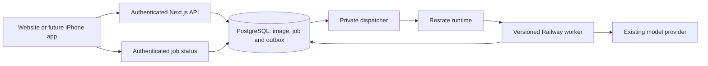

# Restate assessment for Lift Journal

Research date: 6 September 2026. Repository reviewed at `876ced5`. This is an architecture assessment, not an implementation or production benchmark. Website testing remains the current product plan.

## Recommendation

**Restate is a credible fit for durable Coach workflows, but adopting it solely for cron would add unnecessary infrastructure.** Use Railway cron for bounded housekeeping. Evaluate Restate with one image-classification workflow before deciding whether to adopt it for resumable Coach conversations. If the immediate need remains a handful of independent background jobs, prefer a PostgreSQL queue such as pg-boss.

Keep PostgreSQL as the authoritative store for profiles, meals, ingredients, sleep, cardio, photos, conversations and reviewed changes. Restate would coordinate work around those records. The assessment does not authorize new services, schedules, data transfers, purchases or changes to the invitation policy.

## What exists today

| Area | Current implementation | Implication |
| --- | --- | --- |
| Coach execution | [`lib/agent/stream.ts`](../lib/agent/stream.ts) connects cancellation to the HTTP request and stream, with a 100-second stream deadline. [`runTurn`](../lib/agent/engine.ts) also has a 90-second budget. | A disconnected request or process restart can interrupt work. A hard crash can leave a running row behind. |
| Recovery | Completed `agent_turns` responses can be fetched again. An existing turn without a result returns 409 and asks for a new message. Model/tool progress mostly lives in memory. | We have durable final records, but no step-by-step execution recovery. Wrapping the entire existing `runTurn` in a retry would encounter its duplicate-turn guard. |
| Image classification | [`lib/user-images.ts`](../lib/user-images.ts) saves image bytes before calling the model, then awaits classification in the request. Version checks protect manual corrections. | Images survive an interrupted classification, but a restart can leave pending work without an automatic dispatcher. This is a bounded first pilot. |
| Journal writes | [`lib/server.ts`](../lib/server.ts) uses transactions, account-scoped mutation IDs and revision checks. Proposal confirmation is transactional. | Retain these protections with any job engine. Execution recovery does not replace save correctness or user review. |
| Housekeeping | Expired proposals and old chat are purged during subsequent Coach use. The operations runbook documents a Mac-based monitor/daily-backup fallback. | Scheduled cleanup and always-on operations are useful independently of Restate. The backup fallback depends on the Mac being available; its live status was not audited in this research. |

## Where Restate earns its place

| Workload | Fit | Assessment |
| --- | --- | --- |
| Upload → classify → validate → update catalog | Good pilot | Resume after interruption; preserve the image version so late results cannot overwrite a manual edit. |
| Coach reads → model rounds → tools → proposal | Strong longer-term fit | Recover completed steps, bound retries, and let the user return to a result after closing the page. |
| Daily/weekly personal summaries | Good once requested as a feature | Coordinate per-user runs, retry failures and publish a saved result. This requires scheduling preferences and a delivery experience. |
| Cleanup, expired grants, operational jobs | Limited added value | Railway cron is a simpler trigger for short, idempotent commands. Independent uptime monitoring must still work when the application infrastructure is unavailable. |
| Ordinary logging, tagging edits, confirmation/undo | Little added value | Existing PostgreSQL transactions are the appropriate core. |

Restate persists completed durable steps and replays their recorded results. External calls and nondeterministic decisions need deliberate boundaries; timers and retries can survive process failure. Our engine would need a refactor into these boundaries, with stable IDs and bounded retry policies. [Durable steps](https://docs.restate.dev/develop/ts/durable-steps).

A database write or provider request can succeed before its result is recorded by the orchestrator. Consequently, we must preserve database idempotency and cannot promise that an interrupted LLM call will never be billed twice. Restate's database guide explicitly discusses retry-safe conditional writes and separating business data from workflow state. [Databases and Restate](https://docs.restate.dev/guides/databases).

## Cron is a separate decision

Restate's documented cron pattern is a custom scheduler using Virtual Objects and durable delayed calls; native cron is not yet provided by that guide. Its example needs explicit decisions about timezones and overlapping retries. A recurring handler should schedule a short next invocation instead of holding a long-running exclusive object handler asleep. [Restate cron guide](https://docs.restate.dev/guides/cron), [durable timers](https://docs.restate.dev/develop/python/durable-timers).

Railway cron uses UTC, has a five-minute minimum interval, and can run a few minutes late. It skips a scheduled run if the previous one has not exited. It is a trigger, not a workflow checkpoint system. [Railway cron](https://docs.railway.com/cron-jobs).

For future user schedules, persist a validated IANA timezone and explicit opt-in. Define missed-run behavior and daylight-saving transitions; deduplicate with a key such as `(userId, jobKind, scheduledLocalDate, scheduleVersion)`. The journal has an optional timezone field, but no complete per-user scheduling feature. Start with one due-job dispatcher rather than provisioning a Railway service per user. Revoke or cancel scheduled work when access is removed. Do not treat missing entries as observations or send notifications without the user's selected delivery preferences.

## Proposed pilot architecture

Save the uploaded image and its job/outbox row atomically. Dispatch using a stable idempotency key. Restate receives a job identifier; the worker fetches the account-owned image and persists its result conditionally on the original image version. An outbox or equivalent reliable submission is necessary: saving a row and then making an unprotected fire-and-forget call creates a gap where the job can be lost.

Keep raw images out of Restate invocation payloads and durable step results. Returning image classifications or model responses from durable steps still puts potentially sensitive information in execution history, so IDs alone do not eliminate the privacy issue.

For Coach, add a persistent run/status model and an authenticated reconnect path for AG-UI. Closing a page should detach the viewer; an explicit Stop action should cancel the job. Preserve reviewed proposal saves and stale-revision checks. Model rounds, tool results, proposal IDs and event IDs must be replay-stable. Do not record a cached access decision and reuse it indefinitely after invitation revocation; enforce current authorization and deletion checks at execution and commit boundaries.

Restate documents an SSE/pubsub integration with deduplicated events and offsets. That page currently says token-by-token streaming is not supported by its documented pattern. Our existing token stream therefore needs an integration test; it is not a drop-in replacement. Batched progress/final results are a practical first step. [Streaming responses](https://docs.restate.dev/ai/patterns/streaming-responses).

## Operational costs and constraints

- **Deployment:** unfinished invocations normally remain pinned to their original worker deployment. Our current Railway service replaces code at a stable endpoint. Use separately addressable worker versions and drain old versions, or carefully maintain replay compatibility; retain short handlers to limit this burden. [Versioning](https://docs.restate.dev/services/versioning).
- **Hosting:** Restate Cloud removes operation of the execution runtime, but we still host our worker code. Self-hosting on Railway appears feasible with a separate service and persistent volume; this is an architectural inference, not a tested deployment. A single node's durability depends on its disk, and it needs its own backup/recovery plan. [Cloud connection model](https://docs.restate.dev/cloud/getting-started), [self-hosting requirements](https://docs.restate.dev/server/overview).
- **Access:** keep the runtime/admin interfaces private. Verify service request identities, derive account scope server-side, and authorize every job status/event read. Object keys are not user authentication. Invocation headers can be journaled, so do not forward browser cookies or user bearer tokens. [Server security](https://docs.restate.dev/server/security), [service security](https://docs.restate.dev/services/security).
- **Health data:** evaluate region, processor terms, retention, purge/deletion behavior and operator access before using real records. The Cloud docs list US/EU environments. Client-side journal encryption is documented as available on request; do not assume it is enabled or included automatically. [Cloud setup](https://docs.restate.dev/cloud/getting-started), [journal encryption](https://docs.restate.dev/services/security#client-side-journal-encryption).
- **Price:** the published pricing page lists a free tier with 100,000 actions/month and Starter at $75/month with 5 million actions. A call counts as two actions plus intermediate durable actions; larger payloads count in 64 KiB increments. Worker hosting and model calls are additional. Another Restate Cloud page still mentions 50,000 free actions, so verify the account's actual allowance before relying on it. [Pricing](https://restate.dev/pricing), [Cloud page](https://restate.dev/cloud?enterprise=true).

Illustrative sizing, not measured traffic: 10 testers × 4 jobs/day × 30 days × (2 base + 8 intermediate actions) = 12,000 actions/month, before extra dispatch/events/state operations, retries or large payloads. A small pilot may fit the free allowance. We should measure action count, model cost, latency and recovery behavior rather than select a production plan from this estimate.

## Simpler alternative and decision gate

pg-boss uses the PostgreSQL database we already operate and supports transactional enqueueing, retries, delayed jobs, cron and a Drizzle adapter. We would still run a worker and manage queue permissions/migrations. It is the simpler candidate for independent jobs; multi-step resume behavior still needs deliberate job boundaries or application checkpoints. Its delivery guarantees likewise do not eliminate idempotency requirements for external effects. [pg-boss project documentation](https://github.com/timgit/pg-boss).

Compare a Restate image pilot with that simpler queue shape using synthetic images and accounts. Acceptance should demonstrate:

1. An acknowledged upload is eventually classified after worker/runtime restarts and duplicate dispatch.
2. A retry never overwrites a manual category correction or resurrects a deleted image.
3. Revocation and account deletion prevent further private processing and cross-account status access.
4. Provider failures have bounded attempts/cost and a visible terminal outcome.
5. A deployment during work can drain or resume safely; browser reconnect retrieves the same result.

Adopt Restate if recovering intermediate Coach steps and coordinating future personal workflows justify the extra runtime and deployment model. Until then, keep simple scheduled maintenance on Railway cron and use a PostgreSQL queue if reliable background processing is the only immediate requirement. No runtime dependencies or production configuration were changed for this assessment.
