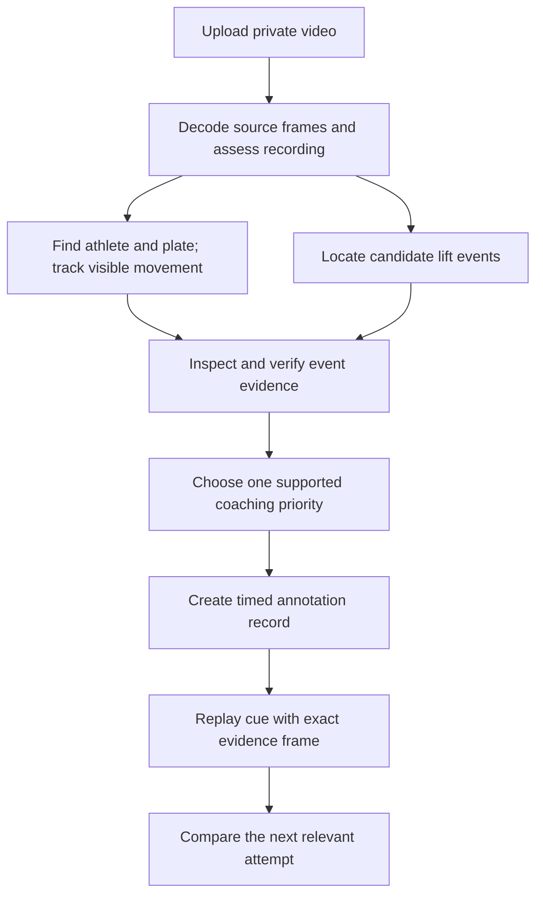

# A reliable Olympic weightlifting video coach

## Recommended direction

Build the product around one outcome: **upload a lift, see the most useful improvement, and replay the exact evidence for it**. The strongest architecture to investigate combines a specialist tracking system, a timeline of verified lift events, and a coach that explains a small number of supported observations. A larger language model alone will not repair a missing catch frame or a drifting bar trace.

The most valuable new research lead is **TimeLens2**, an open-weight model designed to locate events within videos. It is a candidate for finding the rack receipt, jerk dip, or overhead receipt before a second pass inspects those moments. It is not a validated Olympic-weightlifting coach. Equally important, the existing app needs a simpler engineering change: automatic visual bar tracking must work without asking the user to calibrate physical measurements.

This report assesses primary research, official project documentation and product documentation available on 12 September 2026. The local baseline is commit `b546e46`. Proposed components and release criteria below are recommendations, not implemented features or achieved accuracy. The preceding [YouTube pilot](lift-video-benchmark-2026-09-12.md) is the only app-specific model comparison cited here; no additional paid evaluation was performed for this report.

The competitive opportunity is reliable, restrained feedback that improves the next attempt. More skeleton lines, numerical scores, or expensive model calls are useful only when they improve that outcome.

Implementation follow-up: an optional SAM 3.1 integration has now been added locally, with an authenticated GPU gateway, frame-linked region evidence and paused outlines. Checkpoint access, real GPU inference and production activation remain pending. See the [implementation and activation guide](../scripts/video/sam3/README.md) for the exact scope; the research proposals below describe the broader target architecture.

## What the existing app and pilot reveal

The local implementation has several useful foundations: private uploads, background processing, source timestamps, dense inspection passes, evidence-linked feedback, and playback safeguards. Those should be retained. Four gaps explain why the experience can still disappoint.

**The simple upload path does not initialize a bar trace.** In [video request validation](../lib/video/types.ts), automatic analysis excludes calibration. In the [Python analysis worker](../scripts/video/analyse.py), bar tracking starts only when calibration exists. Plate selection and physical scale have become coupled. A user requesting only an automatic review can therefore receive an analysis without the tracked evidence needed for a useful bar overlay. Separate automatic hub detection and pixel tracking from optional centimetres and velocity.

**Available frames are not necessarily the important frames.** The current worker creates 48 initial samples and supplements broad coverage with bursts around global image motion. Its low-resolution motion scout can respond to spectators or camera movement; that is a plausible failure mechanism to test, not a measured explanation for every reported error. Refinement helps, but a catch can still be described using the wrong image. Keep whole-attempt context while selecting additional frames from the athlete and bar regions.

**Valid JSON does not establish valid coaching.** In the pilot, a native-video response passed structural validation while placing a snatch overhead receipt at 1.083 seconds, when the inspected frame still showed the pull/extension. Overhead receipt was visible later. A stronger format validator cannot independently recognize that visual mismatch. The [worker](../lib/video/worker.ts) currently has fixed analysis passes rather than tools for the model to request and inspect additional evidence.

**Tracking continuity is weak and has not been measured against ground truth.** The current fixed-template tracker stops after losing its match. On three manually seeded pilot clips, it retained 3.4%, 38.7% and 9.1% coverage; CSRT returned positions throughout all three. That makes CSRT worth testing, but returning coordinates does not prove they are correct. There are no independent hub annotations for those comparisons.

The pilot used six cases from three videos by one publisher, covering four athletes. It produced 17 completed paid responses across frame and native-video configurations. Some cases are excerpts of the same lift. These results expose defects and generate hypotheses; they do not establish a general model ranking or professional coaching accuracy. The already tested partial-review parser fix also remains distinct from a validated improvement to visual understanding.

## Research that changes the next experiments

### Locate the event before judging it

TimeLens studies how video-language models locate an event in time. Its experiments found that timestamp formatting and noisy temporal labels materially affect results. Interleaving a textual timestamp immediately before each image performed better in its tested setup than the alternative encodings, including timestamps rendered on images. This warrants a controlled comparison with our contact sheets; it does not establish that every model benefits equally.[^1]

TimeLens2 provides 2B, 4B and 8B variants. The 4B model card identifies an Apache-2.0 license and describes returning intervals relevant to a textual query. Its reported average temporal-overlap score across seven datasets is not frame-level accuracy, and none of that establishes catch timing on Olympic lifts. Its example samples at 2 FPS—another reason to use it for candidate intervals, then inspect actual source frames more densely.[^2]

The proposed experiment is narrow: ask the temporal model to locate candidate rack and overhead events, enlarge each interval, then verify the sequence using dense frames and tracked bar/body relationships. Measure whether this reduces wrong replay markers compared with the current refinement pass. Do not introduce an extra model merely because it has a strong general benchmark score.

Two recent sports papers suggest useful designs. SportsTime's coarse-to-fine reasoning separates temporal anchoring, observation and inference, with evidence associated with reasoning steps.[^3] SportsGrounder combines scene context with object-level information to distinguish relevant sports actions.[^4] Both are research leads rather than Olympic-lifting validation. Their practical implication here is to preserve the whole lift while giving the verifier close views of the athlete, bar and feet at the disputed moment.

### Structure the coaching task explicitly

FLEX organizes exercise feedback into actions, phases, errors and corrections. It contains 7,512 samples from 38 participants across 20 loaded exercises, but the listed exercises do not include the snatch, clean or jerk. Its dataset requires a non-commercial academic agreement. Its annotation structure is useful inspiration; its data should not be adopted as a commercial training corpus by default.[^5]

FormCoach evaluates specific corrective feedback using expert-annotated pairs of exercise videos. Its 22 exercises come from general fitness, and its automated feedback evaluation uses an LLM judge. This supports distinguishing evidence, diagnosis and actionable wording, but fluent feedback or a high judge score is not an independent assessment of Olympic coaching quality.[^6]

For this app, create a coach-reviewed rubric specific to each lift phase. An annotation should identify what is visibly happening, whether it warrants correction, which issue matters most, and an appropriate next-attempt cue. Include good lifts and acceptable variations so the system learns when no correction is justified. Expert disagreement should remain visible in the benchmark rather than being hidden by a forced single answer.

### Treat weightlifting validation as a separate requirement

A 2026 single-camera snatch study combines bar detection, tracking and trajectory classification. It reports 70% trajectory-type classification on ten competition videos containing approximately 6,000 frames. This is relevant domain work, but neither the sample size nor the task demonstrates dependable coaching across ordinary gym recordings. The publisher's availability statement does not supply a verified downloadable implementation.[^7]

A 2024 independent comparison of smartphone velocity apps against motion capture included 589 repetitions from 20 competitive powerlifters. The tested Metric version failed to identify 52, while My Lift failed on 175. These are historical app versions and different lifts. The important evaluation lesson is to count missed repetitions alongside errors on successfully measured repetitions.[^8]

Weightlifting research also finds within-session variation under different loads. Sandau and colleagues studied repeated snatch and clean-and-jerk attempts by seven male weightlifters with a controlled recording setup. It supports comparing like conditions and considering natural variability; it does not validate an arbitrary phone camera or make one universal trajectory the correct target.[^9]

## Product references worth borrowing

The following are documented capabilities, not an independently tested ranking of competing products.

| Reference | Useful product lesson | Limit of the evidence |
| --- | --- | --- |
| WL Analysis | Automatic plate detection, manual correction when needed, graph-controlled looping, synchronized comparisons, and AI supplied with both video and a calculated trajectory.[^10] | Its documentation acknowledges occlusion, blur and contrast failures. It does not establish expert-level AI coaching accuracy. |
| Onform | Frame inspection, drawing, slow motion, side-by-side review and voice feedback make a coach's observation easy to demonstrate.[^11] | These interaction capabilities do not establish automatic Olympic-lift understanding. |
| Metric VBT | Recording guidance and version-specific validation are part of the product, rather than treating every uploaded clip as equally measurable.[^12] | Vendor validation summaries and studies of other lifts should not be generalized to snatch peak velocity or technical recommendations. |
| Lift App | Phase-colored timelines and bar/body overlays illustrate a compact review surface.[^13] | App Store feature descriptions are marketing evidence, not validation of forces, muscle activation or coaching scores. |

Greg Everett's guidance on video in weightlifting recommends concentrating on one or two important errors and avoiding constant interruptions to training. It also distinguishes useful filming and review habits from inspecting every repetition compulsively.[^14] The proposed app should carry a focus across attempts, show whether the evidence changed, and avoid issuing a fresh list of faults after every upload.

## Proposed component choices

Start with a small set of challengers and promote them only when they beat a reproducible baseline. Installing every promising library would make attribution, operation and testing harder.

| Responsibility | First comparison | Decision rule |
| --- | --- | --- |
| Preserve and sample video | Existing FFmpeg pipeline, with explicit frame provenance and athlete/bar-based sampling | No skipped attempt, lost rotation, or ambiguity between source and playback time. |
| Find the relevant plate | Fine-tuned RF-DETR Small/Medium plus a separately evaluated hub locator | Correct athlete/plate association and accurate hub position, not only a good bounding box. |
| Follow the hub | CSRT baseline versus TAPNext++ | Lower annotated position error and better recovery, with honest visibility handling. |
| Track body and feet | Existing MediaPipe versus RTMPose body-with-feet through RTMLib; consider RTMW only if needed | Better relevant landmarks during catches and split recovery at acceptable latency. |
| Find candidate phases | Current refinement versus TimeLens2-4B interval proposals followed by dense verification | Fewer missed catches and wrong replay markers on held-out lifts. |
| Explain the evidence | Inexpensive vision-model pass, selectively escalated to Astra | Better independently rated evidence and priorities at a measured total cost. |
| Draw the result | Existing SVG player and shared annotation records | Geometry agrees with the presented frame on actual iPhones and exported replays. |

RF-DETR's Apache-designated Small/Medium detection models are reasonable fine-tuning candidates. Its larger XL/2XL detection variants use a different license, and its keypoint support does not provide a ready-made plate-hub model. Record the exact code and checkpoint licenses before integration.[^15] A rotating logo, box centre or mask centroid must not be silently treated as the physical hub.

TAPNet provides learned point trackers including TAPNext++, with Apache-licensed tracker code and linked weights; dataset terms are separate. Re-detection is attractive for plate occlusion, but an estimated hidden location should remain hidden in the measured overlay.[^16] CoTracker's predominantly non-commercial license makes it a poor default for this intended product without separate permission.[^17]

RTMLib offers ONNX-based pose inference, including body-with-feet and whole-body options, under Apache-2.0 for the library. Evaluate the exact checkpoint and its terms separately. More landmarks are useful only if they improve the observations we need, especially feet, elbows and receiving positions.[^18]

The recommended first production architecture keeps analysis server-side and the browser focused on playback and interaction. Learned tracking and temporal-model experiments may require a separately provisioned inference worker; GPU availability, memory and latency must be measured before choosing hosting. Browser inference can be revisited for previews. ONNX Runtime Web supports several execution backends, but that alone does not establish consistent iPhone performance for this pipeline.[^19]

### SAM 3 and SAM 3.1: a priority segmentation experiment

Add **SAM 3.1** to the first benchmark as an alternative route to automatic object selection and mask tracking. SAM 3 supports detecting, segmenting and tracking objects from text or visual prompts. The documented installation requires a CUDA-compatible GPU, and checkpoint downloads require approved access.[^27] This makes it a server-side analysis candidate; it is not a drop-in dependency for the current browser player.

Meta released SAM 3.1 on 27 March 2026. Its shared-memory multi-object tracking improves efficiency, with mixed changes across concept-segmentation benchmarks and improvements on six of seven listed video-object-segmentation benchmarks. The advertised roughly sevenfold speedup concerns 128 objects on an H100; it does not predict the improvement for one athlete and a plate.[^28]

The proposed role is to find candidate people and plates, choose the athlete/bar pair using spatial and temporal context, and maintain masks for that pair. Those masks could improve evidence crops, prevent background activity from dominating frame selection, and provide a clear outline when a cue concerns the athlete or plate. Prompting for a weight plate is a testable hypothesis, not a demonstrated zero-shot capability on our clips. Keep a single-tap correction available when automatic selection is ambiguous.

Evaluate three configurations: automatic text-prompted SAM 3.1, SAM 3.1 initialized with the same human-selected object as competing trackers, and detector-plus-point-tracker alternatives. Separate object-selection accuracy, visible-mask quality, identity switches, hub-coordinate error, latency and GPU memory. Include thin shafts, overlapping plates, plate rotation, a passing person, spectators, motion blur and partial recordings. Also compare using SAM only to initialize an object with using it throughout the clip; persistent segmentation may not justify its extra cost.

A segmented plate region does not establish its physical hub. Estimate and verify that point separately before drawing a trajectory or deriving speed. Likewise, a person mask does not supply anatomical joint coordinates or identify a jerk dip. The proposed complete pipeline remains **object selection and masks → hub/pose evidence → verified lift events → coaching and timed overlays**. SAM could replace some detection or mask-tracking components if it wins this comparison; it should not automatically be added on top of every other model.

The published SAM License grants royalty-free use and modification without a research-only restriction. It is a custom license, with redistribution and other conditions; preserve the exact applicable terms with the selected code and checkpoint.[^29] Self-hosted inference would allow footage to remain within our chosen infrastructure. A managed inference provider would require a separate decision about cost, retention and private media delivery. No checkpoint access, GPU provisioning or SAM inference has been performed for this assessment.

## How analysis should work

### Preserve context and inspect fast movement

Keep source frame identifiers, presentation timestamps, rotation and crop transforms. Use a smaller viewing copy, but retain enough source detail for evidence crops. Decode the full attempt, including a long pause between clean and jerk. Detect multiple attempts before choosing a review interval; do not assume the largest motion burst is the complete lift.

The visual system should propose candidate transitions from the athlete and bar regions. Around those intervals, inspect genuine source frames at a denser cadence. Benchmark 8, 16 and 30 FPS inspection windows where source cadence allows, rather than declaring a universal sufficient frame rate. Duplicated or interpolated frames do not add independent evidence.

Native video input remains an experiment. Google's documentation describes static processing that defaults to one frame per second and exposes custom static FPS in its documented API.[^20] OpenRouter documents Gemini static/agentic processing selection, but the reviewed video guide does not document an equivalent custom-FPS control.[^21] Verify the actual adapter and route. Explicit timestamped images are the reproducible fallback when the effective sampling cannot be established.

### Build an evidence record before writing advice

The proposed internal record should carry the following independently versioned information:

| Record | Required contents |
| --- | --- |
| Frame | Source identifier, actual timestamp, dimensions, rotation and crop mapping. |
| Track point | Athlete/plate track ID, coordinates, visibility state, localization quality and model version. |
| Event | Event type, candidate interval, verified evidence frames, uncertainty and alternative interpretation. |
| Observation | What is visible, supporting events and frames, and which views or measurements are required. |
| Coaching cue | Priority, supported observation, practical instruction, optional drill and what to check next time. |
| Overlay | Referenced track/frame, drawing type, display interval and whether it depicts an observation or suggestion. |

A clean-and-jerk interpretation needs evidence of the clean/rack sequence and the subsequent overhead action. A recording that begins in the front rack can still support a jerk review. If the preceding clean is absent, preserve the supported jerk feedback and describe the visibility limit once. Uncertainty about an unrecorded phase should not erase valid observations elsewhere.

Distinguish observed, occluded and uncertain track segments. A confidence number emitted by a language model is not a calibrated probability. Combine visibility checks, localization performance on labelled data and event-verification outcomes to determine which claims and overlays are eligible.

### Give the coach bounded inspection tools

Replace the purely fixed model pass with a small internal investigation loop. Candidate tools are `inspect_frames`, `inspect_interval`, `read_visible_tracks`, `compare_attempt` and `verify_observation`. These names describe proposed interfaces; they do not exist in production yet.

For example, if a model suspects movement during the jerk dip, it should inspect the rack hold, dip and drive at higher temporal resolution before writing a correction. It should not infer the whole dip from one frame before and one after it. Allow at most two focused revisits initially, then return supported feedback with any remaining limitation. Benchmark the limit rather than permitting an unbounded expensive conversation between models.

Use a stronger model when evidence is available but interpretation remains difficult. Agreement between two language models is insufficient if both saw the same inadequate frames. Escalation should address a specific disputed observation, not regenerate a longer report from unchanged input.

## The review experience on iPhone

The first screen should contain the video, one main cue, and a **Show me** action. Tapping it loops the relevant interval and offers a freeze on the clearest evidence frame. Keep the explanation below the video so it does not cover the athlete. Detailed graphs, the full phase timeline and secondary observations belong in expandable controls.

Use a short bar trail for an observation about bar movement. Use a small highlight around a visible body segment for an observation about that segment. Show only the overlay needed for the active cue. A complete animated skeleton can remain optional; it should not become visual proof of a recommendation the system has not established.

Separate two meanings visually: **what happened**, drawn from tracked evidence, and **what to try**, presented as an instruction or clearly labelled illustration. Avoid generating an apparently ideal ghost athlete from an unconstrained model. A single vertical line is also an unsuitable universal coaching target: Catalyst's bar-control guidance emphasizes bringing the bar appropriately toward the lifter rather than treating perfectly straight travel as the sole objective.[^22]

The player should use presented-frame timestamps during playback and preserve the existing gap and seek safeguards. `requestVideoFrameCallback` exposes frame metadata but does not guarantee perfect display synchronization.[^23] For a critical paused inspection, display the exact decoded evidence image with its annotation. That avoids asking the user to judge a catch from whichever adjacent frame the browser's seek displayed. Playback remains available for context.

For comparisons, default to the athlete's own previous lift at a similar load and camera angle. Align at a verified event, not only the start of each file. Use side-by-side playback when spatial alignment is uncertain. Show whether the prior coaching focus improved, stayed similar or cannot be assessed from this view.

Keep the upload flow automatic. Only ambiguous athlete or plate selection should request one corrective tap. Filming guidance should be brief: keep the whole athlete and bar visible and keep the camera steady. If the user requests physical measurements, provide the additional view and scale requirements at that point. Do not make those requirements block useful qualitative feedback.

## Measurements: what the first version should and should not promise

An uncalibrated clip can support a visible pixel trajectory, a timed phase replay and qualitative observations. A physical distance requires scale and suitable geometry. Kinovea distinguishes simple line calibration from plane calibration for perspective; one arbitrary scale cannot resolve every movement plane.[^24] Automatically tracking a hub therefore does not make centimetres or metres per second valid.

For velocity, verify real capture time, not just the frame rate of an edited slow-motion file. Evaluate position and velocity separately: small point errors can produce large changes after differentiation, while smoothing can remove a short peak. The current implementation's local-window speed estimate must not be relabelled an instantaneous peak. Validate the claimed quantity against synchronized reference measurements before release.

No bar-mounted sensor is needed for the proposed first visual-coaching experience. A reference encoder or suitable synchronized measurement system would be valuable for a dedicated velocity study. It is an evaluation aid, not a mandatory accessory for every user.

OpenCap Monocular is promising research for future 3D work. Its 2026 study uses a single static smartphone view, biomechanical refinement and validation against motion capture and force plates. The reported validation involves ten healthy adults performing walking, bodyweight squats and sit-to-stand tasks, not snatches and clean-and-jerks. Known height and camera assumptions also matter.[^25] It does not justify adding muscle-force, joint-load or injury-risk claims to this app. Defer those features pending lift-specific validation.

## A benchmark that can select the stack

### Build independent reference annotations

Use public YouTube examples as a diagnostic set, including the three already tested videos, but expand beyond one publisher. Select examples that expose specific failures: long rack pauses, standalone jerks, power and hang variants, failed attempts, multiple repetitions, plate occlusion and camera movement. Catalogue source, athlete, recording conditions, allowed use and any editing. Public availability alone does not authorize redistribution or commercial training.

The next proposed collection is 50 development clips followed by a frozen 100-clip test set across at least 20 athletes and three venues. These are collection targets, not existing data or a statistically sufficient claim of universal accuracy. Include varied skill, body size, clothing, lighting, phone models, frame rates and views, and enough examples of each supported movement to report its results separately.

Keep entire source recordings, athletes and sessions in one split. Adjacent clips of the same repetition must never count as independent test cases. Preserve an additional venue-held-out slice to expose background dependence. Run the final test set once after selection; use fresh cases for subsequent changes.

Two qualified Olympic-weightlifting coaches should independently annotate lift identity, relevant phases, visible issues, priority and actionable cues. Adjudicate disagreements. Define the event semantics precisely—for example, which observable frame constitutes receipt—before evaluating timestamp error. Record the annotators' own timing disagreement. Manually label hub positions and selected body landmarks around the fast phases, with visibility flags and periodic full-clip checks for drift.

A Roboflow plate dataset is a potential detector-development lead, and its reviewed version lists CC BY 4.0 and video-grouped splits. Its image provenance, permitted use and suitability still need checking; detector boxes are not hub-coordinate reference labels.[^26] Avoid silently substituting restricted academic datasets for a consented product dataset.

### Score the failure users actually experience

| Layer | Measures to report | Failure it exposes |
| --- | --- | --- |
| Lift identification | Per-class precision/recall, confusion matrix, abstentions and usable-feedback coverage | Calling a clean and jerk a snatch; refusing every partial clip. |
| Event timing | Median and 90th-percentile boundary error, missed events, whether the selected frame actually shows the named event | A valid timestamp pointing at the wrong movement phase. |
| Hub tracking | Median/95th-percentile position error normalized by plate diameter, visible coverage, drift and identity switches | Smooth-looking trajectories that follow the wrong point. |
| Pose | Error and availability of the specific joints needed for a cue; person switches | Plausible skeletons with wrong elbows or feet. |
| Occlusion | False visible claims, gaps correctly retained and correct re-acquisition | Invented motion while the bar is hidden. |
| Coaching | Blinded coach ratings of evidence, priority and actionability; unsupported-correction rate | Fluent but unnecessary or incorrect recommendations. |
| Product | Upload-to-first-useful-result and full-result latency, failure/retry rate, cost per successful review, iPhone frame alignment | Good isolated inference that becomes a slow or broken experience. |

Report uncertainty intervals and subgroup counts. Also report the proportion of uploads receiving useful feedback. An abstaining system can appear accurate while helping almost nobody. Likewise, do not hide failures by averaging only successful tracking or model responses.

Proposed initial gates are at least 95% precision for confident lift labels and at least 90% useful-review coverage on the clearly reviewable portion of the held-out set. For timing, target a 90th-percentile error below 100 ms for coarse events, with the additional requirement that every displayed evidence frame visibly supports its label. Fine catch inspection may require much tighter timing. For visual hub overlays, investigate a 95th-percentile error below 5% of plate diameter; this is a display target, not sufficient validation for precise physical measurements. All thresholds need coach review and uncertainty estimates before becoming release claims.

### Run experiments in an order that identifies the cause

1. **Input representation:** compare current contact sheets, timestamp-before-image sequences and native video with verified sampling. Match the source interval, visible resolution and information budget where possible. Separate model quality from a provider's unseen sampling choices.
2. **Tracking:** compare the current template, CSRT and TAPNext++ from the same annotated hub seed. Only then test automatic initialization. This separates detector errors from tracker errors.
3. **Pose:** compare MediaPipe and a body-with-feet RTMPose configuration using the same athlete regions. Score catch and split-recovery landmarks, not generic pose benchmark numbers.
4. **Timing:** compare current refinement with TimeLens2 proposals plus source-frame verification. Include truncated clips, long pauses and repeated phases.
5. **Coaching:** give each candidate the same verified evidence; have coaches rate anonymized results. Test escalation only on a predefined difficult subset.
6. **Complete product:** test the full upload, queue, review, navigation, replay and retry flow on real iPhones. Include long clips and multiple concurrent users. Measure latency and cost from upload to useful result, not just one model request.

Prompt optimization, including GEPA, becomes useful after this rubric and a development/held-out split exist. Optimize supported observations and coach-rated utility, not verbosity, schema acceptance or agreement with another LLM alone.

## Delivery priorities

**First: make every review inspectable.** Keep the existing player safeguards and tested partial-review fix. Separate visual tracking from metric calibration. Add exact-frame cue inspection and versioned evidence records. Benchmark automatic tracking and make supported partial feedback survive an unrelated unsupported observation. Release behind a feature flag with comparison against the existing result.

**Second: improve observation and timing.** Build the annotated development set, compare trackers and pose models, and test timestamped inputs and TimeLens2. Introduce bounded evidence-inspection tools only when they demonstrably reduce the known timing and recommendation failures.

**Third: improve coaching across sessions.** Carry one focus into the next comparable lift, use the athlete's own history for context, and measure whether coaches find the resulting priorities helpful. Add a simple optional “helpful / wrong moment / wrong tracking” response to collect failure cases without requiring users to complete a questionnaire.

**Later: validated measurements and richer comparison.** Add physical velocity only after a suitable reference study. Consider synchronized second-camera capture or 3D work when the requested measurement requires it. Advanced features should not complicate the default upload-and-review flow.

Keep the website and account data on the existing application architecture. Analysis jobs should be idempotent, versioned and recoverable, with model timeouts and preserved intermediate evidence. Retries should not charge users repeatedly or overwrite an earlier analysis without traceability. Original clips, evidence images and derived results must remain scoped to the uploading account; comparison and any data collection for training need explicit scope rather than automatic cross-user reuse.

The immediate decision is to invest in measured evidence and an independently labelled evaluation set. A professional experience can then show less, explain it better, and let the athlete verify every important recommendation.

## Sources

Primary research and official documentation below were reviewed for this report. Preprints are identified where relevant; product pages establish documented features rather than independent performance. Links to local files describe this repository's own implementation and diagnostic pilot.

[^1]: Zhang et al., *TimeLens: Rethinking Video Temporal Grounding with Multimodal LLMs*, CVPR 2026 project and timestamp-format ablation: [project page](https://timelens-arc-lab.github.io/).
[^2]: Zhu et al., *TimeLens2: Generalist Video Temporal Grounding with Multimodal LLMs*, 2026 preprint and released implementation: [repository](https://github.com/MCG-NJU/TimeLens2), [4B model card and inference example](https://huggingface.co/MCG-NJU/TimeLens2-4B), [paper](https://arxiv.org/abs/2607.17423).
[^3]: Cao et al., *SportsTime*, 2026 preprint, including coarse-to-fine temporal reasoning: [full paper](https://arxiv.org/html/2604.22226v1).
[^4]: *SportsGrounder*, August 2026 preprint, object-aware sports temporal grounding: [full paper](https://arxiv.org/html/2608.07932v1).
[^5]: *FLEX*, version 3, structured fitness feedback dataset, exercise inventory and data-use agreement: [full paper](https://arxiv.org/html/2506.03198v3).
[^6]: Zuo et al., *FormCoach*, 2025 preprint, fitness feedback annotations and evaluation method: [full paper](https://arxiv.org/html/2508.07501v1).
[^7]: Shah et al., *Single-Camera Barbell Trajectory Analysis for the Snatch Lift*, SN Computer Science, 2026: [institutional record](https://digitalcommons.sacredheart.edu/pthms_exscifac/97/), [publisher abstract and availability statement](https://link.springer.com/article/10.1007/s42979-026-04875-z).
[^8]: Renner, Mitter and Baca, *Concurrent validity of novel smartphone-based apps monitoring barbell velocity in powerlifting exercises*, PLOS ONE, 2024: [full paper](https://journals.plos.org/plosone/article?id=10.1371/journal.pone.0313919).
[^9]: Sandau et al., 2023 research on within-session variability of barbell trajectories in elite weightlifters: [full paper](https://pmc.ncbi.nlm.nih.gov/articles/PMC10534034/).
[^10]: WL Analysis, official tutorial covering tracking, failure conditions, graphs, comparison and AI analysis: [tutorial](https://wlanalysis.com/tutorial.html).
[^11]: Onform, official video-analysis feature and user documentation: [product](https://onform.com/video-analysis-for-coaches/), [user guide](https://support.onform.com/article/153-user-guide-onform-video-analysis-app).
[^12]: Metric VBT, official recording guidance and validation index: [recording a set](https://metric.coach/docs/recording-a-set), [validation](https://metric.coach/validation).
[^13]: Lift App, developer-supplied App Store description and release notes: [listing](https://apps.apple.com/us/app/lift-app-ai-barbell-tracker/id6756862700).
[^14]: Greg Everett, *Using Video in Training Most Effectively*, Catalyst Athletics, 2021: [article](https://www.catalystathletics.com/article/2254/Using-Video-in-Training-Most-Effectively/).
[^15]: Roboflow, RF-DETR official repository, model variants and licensing: [repository](https://github.com/roboflow/rf-detr).
[^16]: Google DeepMind, TAPNet tracker family, checkpoint links and licenses: [repository](https://github.com/google-deepmind/tapnet).
[^17]: Meta, CoTracker official repository and licensing: [repository](https://github.com/facebookresearch/co-tracker).
[^18]: RTMLib official repository, supported pose models, inference backends and library license: [repository](https://github.com/Tau-J/rtmlib).
[^19]: ONNX Runtime, official Web tutorials and execution options: [documentation](https://onnxruntime.ai/docs/tutorials/web/).
[^20]: Google, Gemini API video-understanding documentation, static sampling and processing controls: [documentation](https://ai.google.dev/gemini-api/docs/video-understanding).
[^21]: OpenRouter, video inputs and provider-specific processing behavior: [documentation](https://openrouter.ai/docs/guides/overview/multimodal/videos).
[^22]: Greg Everett, *Bring the Bar to Yourself*, Catalyst Athletics: [coaching reference](https://www.catalystathletics.com/video/1587/Bring-The-Bar-To-Yourself/).
[^23]: MDN, `HTMLVideoElement.requestVideoFrameCallback`, frame metadata and synchronization limitations: [documentation](https://developer.mozilla.org/en-US/docs/Web/API/HTMLVideoElement/requestVideoFrameCallback).
[^24]: Kinovea 0.9.5, calibration mechanisms and perspective: [documentation](https://www.kinovea.org/help/en/measurement/calibration.html).
[^25]: Gilon, Miller and Uhlrich, *OpenCap Monocular: 3D Human Kinematics and Musculoskeletal Dynamics from a Single Smartphone Video*, March 2026 preprint: [full paper](https://arxiv.org/html/2603.24733v1).
[^26]: Roboflow Universe, Olympic Weightlifting Tracking, dataset version 6 metadata and license: [dataset page](https://universe.roboflow.com/bar-path/olympic-weightlifting-tracking-jjni3/dataset/6).
[^27]: Meta, SAM 3 official capabilities, installation prerequisites and checkpoint-access instructions: [repository](https://github.com/facebookresearch/sam3).
[^28]: Meta, SAM 3.1 release notes, 27 March 2026: [release notes](https://github.com/facebookresearch/sam3/blob/main/RELEASE_SAM3p1.md).
[^29]: Meta, SAM License, last updated 19 November 2025: [license text](https://raw.githubusercontent.com/facebookresearch/sam3/main/LICENSE).
