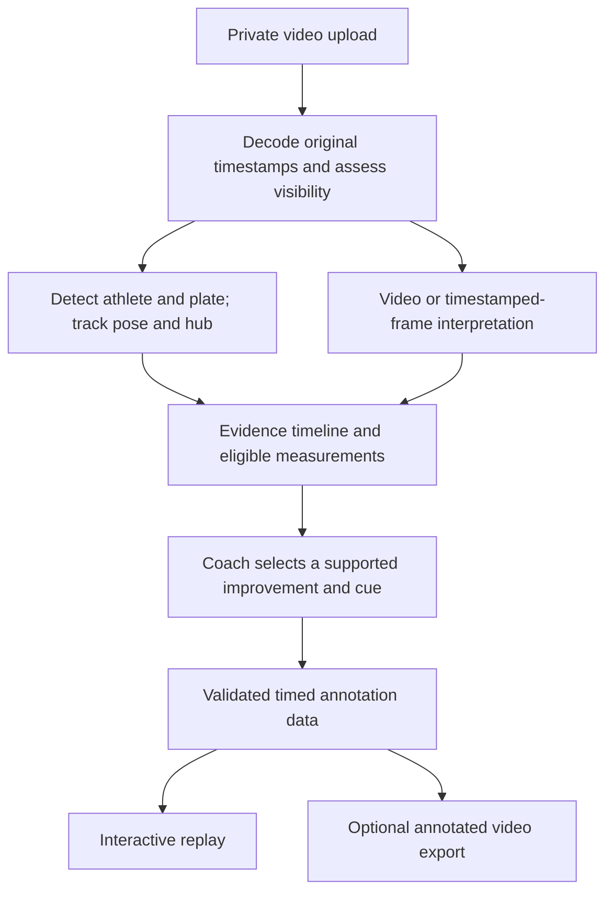

# Lift analysis and overlays: research and implementation proposal

Research date: 12 September 2026. Baseline: `d368064a268d8bf656b31f37dda0992f21945aa0`.

## Recommendation

Build a measured video-analysis pipeline with a coaching layer. The strongest next investment is automatic plate/hub tracking, better athlete tracking, and an evaluated lift-phase timeline. Use a vision-language model to interpret visible events and explain a small number of useful corrections. Generate overlay geometry from tracked evidence, never from prose alone.

Recommended first comparison: **RTMPose through RTMLib + a plate-specific RF-DETR detector + TAP tracking**, against our current MediaPipe/template-tracking baseline. Compare **Gemini 3.8 Flash video**, **Qwen3.6-27B video**, and **GPT-6 Astra on timestamped frames** for phase interpretation and grounded coaching. These are candidates, not a demonstrated ranking. Model names and licenses were checked against current primary sources; none was invoked in this research.

The user experience remains: **upload → receive one main improvement → tap to see the relevant moment → try a cue on the next lift**. Calibration and tracking corrections belong behind optional controls.

## What our current implementation actually does

The recent changes improve evidence handling and playback, but do not establish that the advice is accurate:

- FFmpeg preserves decoded-frame timestamps and produces a viewing copy. Coarse and refined passes supply contact sheets to the model; the model does not receive continuous video.
- MediaPipe Lite estimates body landmarks. A custom torso/scale heuristic follows the foreground athlete. This is vulnerable to occlusion, spectators and unusual receiving positions.
- Bar tracking in `scripts/video/analyse.py` requires manual calibration. It matches a fixed grayscale template and permanently stops when the match is lost. It has no trained plate detector or learned re-identification.
- The refined model pass independently identifies visible phases and cites frames for corrections. Schema checks enforce chronology and evidence structure; they cannot establish that a front-rack catch or technical error was actually seen.
- The player already supports exact-frame inspection, short optional bar trails and evidence-linked cues. These foundations should be retained.

Code references: [analysis](../scripts/video/analyse.py), [pose](../scripts/video/pose.py), [review](../lib/video/review.ts), [player](../components/video-guided-replay.tsx), and the [current implementation notes](video-evidence-review-2026-09-12.md). Existing synthetic regression tests verify behavior, not real-lift coaching quality.

## What established tools teach us

**WL Analysis** documents automatic plate detection, trajectory tracking, calibration, synchronized comparisons and exported overlays. It now also sends a selected video segment and its calculated bar trajectory to an AI model for coaching. Its manual explicitly describes failures from occlusion, poor contrast and blur. This supports combining measured tracks with AI interpretation, while retaining a simple correction path when automatic tracking fails. Its public documentation does not reveal enough to reproduce its internal model stack or establish its Olympic-lift coaching accuracy. [WL Analysis tutorial](https://wlanalysis.com/tutorial.html)

**Kinovea** provides a useful interaction reference: synchronized comparisons, annotations at key positions, slow playback and motion measurement. It is an open-source sports-analysis application, not a drop-in web component. Use it as a reference for manual annotation and product behavior. [Kinovea](https://www.kinovea.org/)

**Metric VBT** illustrates the importance of validation. One published study compared video measurements against motion capture in nine participants performing squat, bench press and deadlift. That is evidence about those measurements and conditions; it does not validate our software, peak velocity in a snatch, or automated technique coaching. [Taber et al., validation study](https://sacredheart.elsevierpure.com/ws/portalfiles/portal/39924743/Validity%20and%20Reliability%20of%20a%20Computer%20Vision%20System%20to%20Determine.pdf)

## Open-source components worth testing

The following roles and selection decisions are our engineering proposal. License labels refer to the cited components; datasets, dependent assets and exact checkpoints still need their own manifest.

| Component | Useful role | Recommendation and constraint |
|---|---|---|
| [RTMLib / RTMPose](https://github.com/Tau-J/rtmlib) | Body and foot landmarks with ONNX inference | First pose challenger. RTMLib avoids the full MMPose/MMCV dependency stack and supports RTMPose, RTMW and ViTPose variants. Compare a body-with-feet model against MediaPipe; do not assume generic pose scores predict lifting accuracy. Apache-2.0 library. Pin and bundle weights; the project documents an OpenMMLab download mirror. |
| [RF-DETR](https://github.com/roboflow/rf-detr) | Automatic plate detection and segmentation | Fine-tune an Apache-designated Small/Medium model on consented lifting frames. Generic pretrained classes do not make it a plate/hub detector. Evaluate hub localization separately from bounding-box accuracy. XL/2XL detection models use a different license; keypoint support is currently preview. |
| [TAPIR / BootsTAPIR / TAPNext++](https://github.com/google-deepmind/tapnet) | Follow identified points through the clip | Compare learned point tracking against template matching. Code and linked tracker checkpoints are Apache-2.0; benchmark data has separate terms. Start with TAPNext++ and an established BootsTAPIR baseline. |
| [ByteTrack](https://github.com/FoundationVision/ByteTrack) | Associate detections across frames | MIT-licensed baseline for maintaining athlete/plate tracks. A track ID is not proof that the same athlete survived an overlap; test identity switches explicitly. |
| [SAM 2](https://github.com/facebookresearch/sam2) | Propagate a selected athlete/plate mask | Apache-licensed code/checkpoints. Useful as a segmentation challenger or annotation aid after a seed is identified. A mask alone does not measure a hub or decide which athlete matters. |
| [SAM 3 / 3.1](https://github.com/facebookresearch/sam3) | Text/exemplar-guided detection, segmentation and tracking | Worth a separate experiment for automatic initialization and difficult overlaps. Current repository includes SAM 3.1 and requires CUDA in its documented setup. Custom SAM License, rather than Apache; do not install it as an assumed permissive substitute. |
| [Sports2D](https://github.com/davidpagnon/Sports2D) | Reference implementation for 2D trajectories and angles | BSD-3-Clause. Useful for comparing pose-derived measurements and visualization. Its documentation explicitly limits reliable interpretation to suitable motion planes and camera positions. |
| [Supervision](https://github.com/roboflow/supervision) | Detection adapters, annotation and offline rendering | MIT-licensed utility library. Useful for evaluation exports; it does not supply the lifting-specific detector or verify a recommendation. |

[TAPNext++](https://tap-next-plus-plus.github.io/) specifically studies recovery after disappearance. That addresses a weakness in our current tracker, but its occluded positions remain predictions. Our renderer should leave gaps while the object is hidden and resume only when evidence supports the same hub.

Two attractive options should not be default dependencies: [CoTracker](https://github.com/facebookresearch/co-tracker) is predominantly CC-BY-NC, and [Ultralytics](https://www.ultralytics.com/license) offers AGPL/Enterprise licensing. Neither is equivalent to a permissively licensed component for a future commercial app. This is a component-selection constraint, not a recommendation to publish private footage or user data.

## Video and language models

| Candidate | What to test | Boundary |
|---|---|---|
| [Gemini 3.8 Flash](https://ai.google.dev/gemini-api/docs/video-understanding) | Complete phase sequence from a video, with focused revisits around a catch or jerk | Current documentation supports static and agentic video processing. Static defaults to 1 FPS; custom FPS is supported in static mode. Compare explicit dense short clips against agentic exploration. Long-video efficiency claims do not establish lift accuracy. |
| [Qwen3.6-27B](https://huggingface.co/Qwen/Qwen3.6-27B) | Self-hosted video interpretation and evidence-linked feedback | Apache-2.0 open weights, documented video input. Its serving example defaults to 2 FPS; sampling configuration matters. It requires a separately provisioned inference service and measured memory/latency. |
| [Qwen3.5-9B](https://huggingface.co/Qwen/Qwen3.5-9B) | Smaller self-hosted candidate for cost comparison | Apache-2.0 with video support. Include as a lower-cost hypothesis, not an established adequate coach. Quantization and frame count must be evaluated alongside accuracy. |
| [GPT-6 Astra](https://developers.openai.com/api/docs/models/gpt-6-astra) | Stronger reasoning over selected full-resolution frames and measured tracks | Its API model page lists image input and no video input. It can review frame sequences but should not be described as watching the uploaded MP4. Benchmark against the current production model before choosing it for escalations. |

OpenAI's [vision documentation](https://developers.openai.com/api/docs/guides/images-vision) explicitly notes limits in precise spatial localization. In our architecture, all language models receive measured coordinates and evidence; they do not author bar-speed values or anatomical coordinates.

The [F-16 research paper](https://arxiv.org/html/2503.13956v2) provides experimental support for evaluating higher temporal sampling in fast sports. Its comparisons involve older proprietary models and other sports, so it is evidence for a sampling experiment, not a current model ranking or proof that 16 FPS is always sufficient.

**OpenRouter remains a viable transport.** Its current [video documentation](https://openrouter.ai/docs/guides/overview/multimodal/videos) supports video content and Gemini processing-mode selection, with provider-specific URL restrictions. A supported model name alone does not prove that our request delivers video at the intended sampling rate. Test the exact endpoint, processing controls and privacy-compatible provider route. Use private server-side media delivery; never make user clips public to satisfy a provider URL requirement. A native provider adapter may be needed if essential sampling controls are unavailable through the selected route.

## Proposed analysis pipeline

### 1. Preserve the movement

Decode real source timestamps, rotation and actual frame cadence. Keep the whole attempt, including the clean-to-jerk transition. Detect multiple attempts and partial recordings. Do not manufacture temporal evidence by interpolating frames. Distinguish encoded playback time from real capture time for edited slow-motion footage.

Keep dense CV tracking separate from the model's visual-token budget. An initial experiment should compare 8, 16 and 30 genuine frames/second around fast phases, bounded by source cadence and endpoint support. These are experimental settings, not accuracy guarantees. Whole-attempt context must remain available when a focused crop is inspected.

### 2. Track the athlete and the plate hub

Select the athlete interacting with the moving bar, not simply the largest person. Associate the plate with that athlete. Detect the plate periodically and track its hub between detections. Use motion continuity, appearance and visibility together. Compare this against mask-based tracking on the same clips.

The plate's printed logo rotates; the hub is the physical tracking target. A changing mask centroid or bounding-box center is not automatically the hub. Label hub centers explicitly. Reject drift, identity changes and implausible discontinuities. Moving-camera clips need camera-motion assessment; if correction is unreliable, retain qualitative feedback and omit displacement measurements.

Automatic selection should be the default. Only an ambiguous clip should offer “Tap your bar” or “Select yourself,” with usable feedback on the portions already understood.

### 3. Construct a phase timeline before coaching

Represent observations separately: pull, turnover, front-rack receipt/hold, clean recovery, jerk dip/drive, overhead receipt and recovery. Combine pose/bar relationships with temporal visual evidence. Keep event timestamps, visibility and alternative interpretations.

A clean-and-jerk identification should be supported by a front-rack receipt followed by a separate overhead action. One overhead image cannot establish a snatch. A clip beginning in the rack can still support feedback about the visible jerk; it cannot establish the preceding clean. Preserve valid partial feedback when other phases are unclear.

Initially use constrained phase logic plus a video model. Train a small temporal classifier only after we have reliable labels and know which failures remain. Multiple models agreeing is useful triage, not ground truth.

### 4. Make coaching specific and testable

Each correction should contain: the visible observation, evidence timestamps, one practical cue, an optional relevant drill, and what to look for on the next attempt. Prioritize one issue; show at most two additional useful observations. Let users report “wrong lift,” “wrong person,” “bad tracking,” or “unhelpful advice” without rewriting the whole review.

A perfectly vertical line must not become a universal ideal for the snatch or clean. Catalyst Athletics emphasizes active bar control and balance rather than chasing that simplified trajectory. Use a reviewed, source-linked coaching rubric and account for phase, camera angle and the athlete's own comparable attempts. Do not infer foot pressure, muscle activation or a medical diagnosis from a skeleton overlay. [Catalyst Athletics: bar control](https://www.catalystathletics.com/video/1587/Bring-The-Bar-To-Yourself/)

Prompt optimization such as GEPA becomes useful after expert-labelled cases and a held-out evaluation exist. It cannot recover a phase that preprocessing omitted or make an incorrect track accurate.

## Overlays that explain the recommendation

Generate one versioned annotation record per cue: source frame/time, track ID, observed geometry, supporting evidence IDs, visibility, caption and cue. Restrict model output to this schema; never execute model-generated JavaScript, SVG markup or FFmpeg arguments.

- **Observed movement:** a short bar trail, a visible joint segment or a highlighted receiving position. Draw only supported geometry.
- **Suggested action:** a clearly labelled cue or illustrative arrow. Keep it visually distinct from measured motion; never present an invented “ideal” skeleton as this athlete's correct position.
- **Interaction:** tap a cue to loop its short interval or freeze at the clearest evidence frame. Keep text below the video and the main action unobstructed. Show detailed traces and charts only on request.
- **Comparison:** synchronize two of the athlete's comparable lifts at the same phase. Avoid uncalibrated ghost overlays between unrelated camera angles or athletes.

Retain SVG for a few interactive annotations, using presented-frame timestamps and the actual displayed video rectangle, including letterboxing. The browser's [`requestVideoFrameCallback`](https://developer.mozilla.org/en-US/docs/Web/API/HTMLVideoElement/requestVideoFrameCallback) exposes media timestamps but does not guarantee perfect compositor synchronization; retain seek guards and test real iPhones. Use Canvas only when annotation density justifies it. For downloads, render the same annotation data with OpenCV/Supervision and [FFmpeg overlay filters](https://ffmpeg.org/ffmpeg-filters.html#overlay). Sharing/export must remain an explicit user action.

## Measurement and 3D boundaries

No attached sensor is required for useful visual coaching. Metric displacement and velocity require valid scale, camera geometry and real elapsed time. Use a known dimension in the relevant motion plane; do not silently assume every plate is 45 cm. Without calibration, show the track and qualitative feedback, not centimeters or meters/second. [Kinovea calibration](https://www.kinovea.org/help/en/measurement/calibration.html)

Keep velocity validation separate from position validation: differentiation amplifies tracking noise and smoothing can suppress short peaks. Evaluate mean and peak velocity separately against synchronized reference measurements. Do not publish force, power or joint-load estimates from an unvalidated single-view pipeline.

**3D should be a later experiment.** [SAM 3D Body](https://github.com/facebookresearch/sam-3d-body) reconstructs a human mesh from a single image under a custom license; a plausible mesh is not measured biomechanics. [OpenCap Monocular's 2026 paper](https://arxiv.org/html/2603.24733v1) is more directly relevant to biomechanics, but reports weaknesses for jumping tasks and evaluates a particular camera setup. Neither source establishes validity for our Olympic-lifting use case. Additional calibrated views are a stronger future option when true 3D measurements matter.

## Evaluation before release

Start with approximately 50 consented clips to expose failures, then build a larger held-out set across athletes and venues before choosing a production stack. Include complete snatches and clean-and-jerks, rack jerks, power/hang variants, missed lifts, partial clips, multiple attempts, spectators, plate occlusion, camera movement, portrait/landscape, low light and retimed video. Include the reported failures once the original clips are available with permission.

Have qualified Olympic-weightlifting coaches independently label movement, key phases, visible issues and useful cues; adjudicate disagreements. Annotate plate hubs and relevant body landmarks in a representative subset. Split by athlete/session/venue rather than neighboring frames. Keep consented evaluation footage private and separately authorize any training use.

| Question | Measure |
|---|---|
| Does it identify the correct movement? | Per-class precision/recall, confusion matrix, abstention and feedback coverage |
| Does it see the important moments? | Phase-event timing error and missed-event rate, especially rack receipt and jerk drive |
| Does the overlay follow reality? | Hub/keypoint error, drift, identity switches and correct recovery after occlusion |
| Is the coaching useful? | Blinded expert ratings of correctness, priority, actionability and unsupported claims |
| Can athletes use it? | Time to understand the main cue, replay usability, correction rate and iPhone playback failures |
| Is it affordable? | End-to-end p50/p95 latency and total cost per expert-accepted review, including retries |

Proposed initial release gates—not achieved results: no regressions on the known clean-versus-snatch/partial-jerk cases; at least 95% precision for confident movement labels alongside at least 90% useful-feedback coverage on clearly reviewable clips; at least 90% of published main cues judged correct and actionable by experts; and zero known wrong-person overlays in the release set. Report sample sizes and uncertainty. Tune geometric error limits with coaches before scoring them; loose bounding boxes are insufficient for small displacement claims. Do not meet the precision gate by withholding nearly all reviews.

Compare the existing pipeline, video-model-only analysis, and CV-plus-model analysis on identical clips. Then isolate changes: pose model, tracker, sampling, reasoning model and prompt. Choose the smallest stack meeting the gates. Re-test after any model, checkpoint, prompt or decoder change.

## Delivery order and operating cost

1. Build the private benchmark and record current results. Establish whether sampling, tracking or interpretation causes each reported failure.
2. Compare RTMLib pose and learned plate/hub tracking. Implement automatic initialization and evidence-linked overlays using the winning configuration.
3. Compare the model candidates and sampling strategies. Use a bounded escalation for ambiguous interpretation only when it improves measured outcomes; missing footage should not trigger repeated expensive calls.
4. Release to a small invited group with versioned results and easy corrections. Add calibrated speed and cross-session comparisons after their separate validation.

Keep the existing account-scoped storage and durable job/checkpoint machinery. Run heavier CV or self-hosted vision models in a separate worker, rather than inside the Railway web request. Bundle pinned weights, bound concurrency, and keep private media and derived tracks under the same access/deletion rules. Provider changes must preserve the app's privacy requirements.

Self-hosted weights remove per-token provider charges, not compute costs. Measure GPU processing time, cold starts, idle capacity, video-token use, escalation frequency, storage and egress before quoting a cost per upload. No paid inference, GPU provisioning, user-video upload to a new provider, or production model change was performed for this research.
