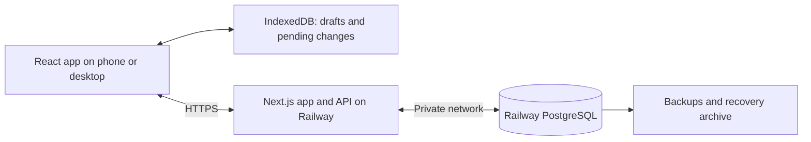

Lift Journal production readiness plan — 5 September 2026

Recommendation: rebuild the interface in TypeScript, React and Next.js, run the application server on Railway, and store account and training data in Railway PostgreSQL. Preserve the existing progression rules, historical prescriptions, import/export and offline workout logging.

This is a proposed implementation plan. The initial scope assumes personal use with sign-in and sync across devices, pending the audience decision. Design data ownership for separate accounts from the start. If athlete/coach collaboration is required at launch, include the additional permissions and programme-assignment work described below.

The current repository is a static GitHub Pages PWA. `js/app.js` contains about 1,900 lines of rendering and interactions; `js/storage.js` saves the whole account state in localStorage; `js/progression.js` already isolates the progression rules. There are 23 progression tests and a substantial browser smoke suite. Reuse these rules and behavioural expectations while replacing the UI and storage layers.

The finished app should let an athlete sign in, import existing training, start or resume a workout, log sets with or without connectivity, and see the confirmed result on another device. Operators should be able to detect failures, recover a database, and release an update without losing a workout.

Proposed technology choices:

| Layer | Choice | Purpose |
| --- | --- | --- |
| Language | TypeScript, strict mode | Check data contracts and component inputs throughout the application. |
| Frontend and server | Next.js 16.3 with React 19.2, App Router | One application for the interface, sign-in and server API; use client components for the interactive workout. |
| Styling and components | Tailwind CSS 4 and customised shadcn/ui components | A consistent visual system, accessible controls and responsive layouts. |
| Database | PostgreSQL on Railway | Durable training history and account data shared across devices. |
| Database access | Drizzle ORM and reviewed SQL migrations | Typed queries, relational constraints and versioned schema changes. |
| Authentication | Better Auth with its Drizzle adapter | Established session handling; initially one OAuth provider and an allowlist for a private pilot. |
| Local persistence | IndexedDB with a small storage adapter | Durable local drafts and a queue of changes awaiting server confirmation. |
| Validation | Shared runtime schemas, proposed Zod | Validate imports and API requests independently of TypeScript. |
| Verification | Existing progression cases, PostgreSQL integration tests and Playwright | Cover business rules, data ownership, migration and real browser workflows. |

Next.js 16.3 is a current stable release with improvements for application navigation. Use its stable capabilities initially. Railway documents deploying Next.js alongside Postgres. [Next.js release](https://nextjs.org/blog/next-16-3), [Railway deployment guide](https://docs.railway.com/guides/nextjs).

The npm `latest` metadata checked on 5 September reported Next.js 16.3.4, React 19.2.8, TypeScript 7.0.2 and Tailwind CSS 4.3.3. Recheck compatible stable patches and security advisories when scaffolding, then commit a lockfile. These observations are dated, not instructions to install unpinned dependencies in production. [Next.js metadata](https://registry.npmjs.org/next/latest), [React metadata](https://registry.npmjs.org/react/latest), [TypeScript metadata](https://registry.npmjs.org/typescript/latest), [Tailwind metadata](https://registry.npmjs.org/tailwindcss/latest).

shadcn/ui supplies components that we own and customise. Better Auth documents both Next.js integration and Drizzle support. [shadcn/ui](https://ui.shadcn.com/docs), [Better Auth integration](https://better-auth.com/docs/integrations/next), [Drizzle adapter](https://better-auth.com/docs/adapters/drizzle).

The browser communicates only with the application API over HTTPS. The application server accesses Postgres over Railway private networking. Database credentials remain server-side. Put the app and database in the same European region, selected during setup, with separate production and staging databases and secrets. Railway supports private connections between services. [Private networking](https://docs.railway.com/networking/private-networking).

Build and rollout sequence:

| Phase | Work | Exit criterion | Estimated focused effort |
| --- | --- | --- | --- |
| 1. Product and design | Confirm audience; map current flows; establish design tokens; prototype Home, Workout and Progress; prove a Next.js workout shell can reload offline on iPhone. | Reviewable screens and a working technical spike for the highest-risk interaction. | 2–3 days |
| 2. Application foundation | Create the TypeScript app; extract shared progression logic; configure CI, server API, staging and deployment health checks. | A tested staging release with reusable layout and the existing progression cases passing. | 2–3 days |
| 3. Accounts and PostgreSQL | Add authentication, ownership checks, migrations, programme seeds, workout persistence, backups and the legacy importer. | An imported workout survives restart and is available to its owner on a second device; another account is denied access. | 4–6 days |
| 4. Complete interface | Implement all current routes and states, including programme detail pages, gym accessories, history editing, PRs, charts and technique links. | Current capabilities work in the new design on mobile and desktop. | 4–6 days |
| 5. Offline sync and hardening | Implement persistent local saves, retries, duplicate protection, conflict recovery, account switching and service-worker updates; test failures. | Offline and cross-device scenarios pass without silent loss or duplicated completed sessions. | 4–6 days |
| 6. Pilot and cutover | Rehearse import and database restore; test on a physical iPhone; observe staging costs; migrate the account and enable the production domain. | Launch criteria below are met and a recovery procedure has been rehearsed. | 2–3 days |

The baseline estimate is 18–27 focused development days, roughly 4–6 working weeks for one developer. It includes preserving offline behaviour. It is an initial planning estimate, with authentication setup, design iteration and sync edge cases the main uncertainties. Phase 1 should narrow it. Coach collaboration would add scope and needs a separate estimate before implementation.

Visual direction:

- Keep the existing weightlifting identity: warm neutral surfaces, charcoal type, and red/blue/gold plate accents. Turn these into consistent colour, spacing, radius and typography tokens.
- Make Home answer “What am I training today?” with one prominent start/resume action, permanent access to solo and gym programmes, and compact progress information.
- Make Workout the strongest screen: large readable loads, stable number inputs, 44–48 px touch controls, one exercise expanded at a time, and actions that remain usable with the iPhone keyboard open.
- Give Programme pages a clear hierarchy of prescription, technique and guidance. Keep programmes browsable while another session is active.
- Make History easy to scan by date and programme. Make charts explain load and training consistency with text equivalents and sensible empty states.
- Design saving, offline, sync conflict, loading, error and empty states alongside the normal screens. Use subtle motion, respect reduced-motion preferences, and verify contrast and keyboard navigation.
- Test Safari and installed iPhone PWA behaviour. Tailwind 4's documented browser baseline includes Safari 16.4; confirm the user's oldest supported device before committing to that baseline. [Browser compatibility](https://tailwindcss.com/docs/compatibility).

A framework will make the interface easier to build and maintain. The visual improvement comes from these design decisions and testing the actual workout flow.

Proposed database model:

| Data | Structure and constraints |
| --- | --- |
| Identity | Better Auth users, linked accounts and auth sessions; athlete profiles and preferences owned by user ID. |
| Exercise library | Stable exercise IDs, names, cues, categories and video/source links. Seed the existing 23 exercises. |
| Programmes | Programmes, immutable programme versions, days and exercise prescriptions. Preserve stable programme/day identity for progression across revisions. Seed the existing five templates. |
| Training history | Workout sessions, workout exercises and individual sets. Each session belongs to an athlete; include exercise/set ordering and snapshotted targets. |
| Active workout | One accepted active draft per athlete, with a versioned JSONB payload and revision number. Preserve incomplete input and an optional reference to a historical session being edited. |
| PRs and targets | Per-athlete values and goals, optionally linked to supporting workout sets. Existing personal defaults belong only to the migrated account. New users start with their own onboarding data. |
| Synchronisation | Mutation IDs, entity revisions, a change cursor and deletion tombstones. Record import batches and stable legacy-to-new ID mappings for repeatable imports. |

Use client-generated UUIDs for new entities. Map existing prefixed IDs during import rather than assuming they are UUIDs. Keep historical weights in an exact Postgres numeric representation and retain manual fractions; round only generated targets according to the existing rules. Store training dates as `date` and event timestamps as `timestamptz`, alongside the athlete's timezone.

Use foreign keys, non-negative weight constraints, valid set outcomes and rep/RPE validation. Index athlete/date and athlete/programme/day lookups. Prevent cross-account parent/child references. Finish a workout in a transaction that records the session and sets, retires the draft and records the mutation result together. Treat historical prescription snapshots as immutable; authorised edits to logged results remain possible and should be auditable.

Port `js/progression.js` to a shared TypeScript domain module. Both browser previews and the server use the same rules. The server computes authoritative future plans from accepted history; it must not silently re-prescribe work already entered offline. Programme revisions, progression revisions and source sessions remain attached to each prescription.

For coach access, add explicit athlete/coach relationships, scoped programme assignments and authored feedback. Grant access only to invited athletes and permitted records, support revocation, and test all coach endpoints. An ordinary user role must never imply access to every athlete. Preserve athlete notes and coach feedback as distinct fields.

Existing-data migration:

1. Keep the old GitHub Pages app reachable while the new application is tested on a separate hostname.
2. Export a JSON backup from each browser or installed PWA containing training. The new domain cannot directly read the old domain's localStorage; the backup/import workflow is the dependable bridge. [localStorage origin scope](https://developer.mozilla.org/en-US/docs/Web/API/Window/localStorage).
3. After sign-in, validate the backup's schema and show a preview of sessions, sets, PRs and active draft. Explicitly identify duplicates or conflicting versions before applying it.
4. Import in a transaction, preserving training dates, fractional weights, logged/missed status, notes, prescription snapshots and draft edits. Retain a mapping of source IDs and a batch fingerprint so retrying the same import is safe.
5. Compare counts and key values, open the draft, and compare next-session progression with the old app. Exercise v1 and v2 fixtures, invalid files and conflicting device backups.
6. Agree a final switch point so new workouts are logged in the new app. Keep the old origin available for export and recovery; do not automatically clear its data or redirect users before they have migrated.

Offline and sync rules:

- Save each edit to IndexedDB before showing “Saved on this device”; save the pending mutation in the same local transaction. Show “Synced” only after the API confirms database commit.
- Persist pending changes across tab closure and browser restart. Retry on app opening, reconnect and foreground return with backoff. Correctness must not depend on background execution on iOS.
- Send a unique mutation ID and expected entity revision. The server stores the result atomically and returns the same result for retries, preventing duplicate workout completion.
- Reject stale revisions with a conflict response. Preserve both versions and let the athlete review them. Start with workout-level conflict detection rather than attempting automatic merges of training numbers.
- Preserve a second offline draft if another device has already started a session; resolve the conflict without discarding entered sets. Local changes in two tabs must also pass through one coordinated queue.
- Keep per-account local stores and clear user-visible state on account changes. Expired sign-in pauses upload until the same account authenticates. Before sign-out removes local data, offer sync or export for pending work.
- Cache the public app shell and static assets explicitly. Exclude authentication, personalised HTML, API responses and framework data responses from generic service-worker caching. Keep authorised offline training data in the account-scoped local store.
- Test installed-app cold start offline, navigation, expired authentication and safe version upgrades. The current service worker broadly caches same-origin GETs, so its strategy must be redesigned for an authenticated Next.js app.

Production operations:

- Enforce authentication and ownership at every data-access operation. Take the athlete identity from the server session, validate input, use parameterised queries and keep the runtime database role separate from schema-migration privileges.
- Use secure HttpOnly session cookies, trusted-origin/CSRF protections, appropriate security headers, and rate limits for authentication, imports and writes. Keep credentials out of browser bundles and redact workout notes, tokens and backup contents from logs.
- Use a bounded database connection pool with timeouts. Run migrations once during a release in Railway's environment, where the private database is reachable; build the application without querying production data.
- Pin the database major version and compatible app/runtime dependencies. Rehearse upgrades in staging. Use additive schema changes so the previous app build can run during deployment and rollback.
- Add structured server logs, frontend error reporting with sensitive fields removed, an external uptime check and alerts for API failures, storage pressure, connection exhaustion and backup/archive failures. Expose separate basic liveness and database-readiness checks.
- Enable scheduled backups and point-in-time recovery before importing real data. Railway's standard Postgres service still leaves configuration and maintenance responsibilities with the operator. [Postgres operations](https://docs.railway.com/databases/postgresql), [Scheduled backups](https://docs.railway.com/volumes/backups).
- Rehearse point-in-time restore into a separate database service, verify imported workouts, switch the application's database connection and re-enable recovery archiving on the restored service. Aim initially for at most five minutes of lost server-confirmed data and recovery within four hours; these are targets to measure, not platform guarantees. Keep a separate encrypted logical backup outside the application's project to cover project/account loss. [Railway point-in-time recovery](https://docs.railway.com/volumes/point-in-time-recovery).
- Start the private pilot with one app service and one database. Database maintenance or failure can interrupt online sync; this is not a high-availability deployment. Revisit Railway HA and multiple app replicas if launch scope requires stronger uptime, with shared rate limits and connection budgets included.
- Keep JSON export available. Before opening registration, document stored data, retention, account deletion, backup expiry and third-party video access, and implement the corresponding account controls.

Launch criteria:

- Existing progression cases pass unchanged in meaning, including whole-kilogram increases, recovery holds, manual loads and same-date protection.
- Importing the same backup twice creates no duplicate sessions; invalid imports leave the database untouched; real migration counts and next-session loads match.
- Logging offline, closing the app, reopening, reconnecting and retrying completion preserves every explicitly saved set and produces one completed session.
- Two devices editing the same workout produce a recoverable conflict; neither silently overwrites the other. Deletions do not resurrect when an old device reconnects.
- Separate accounts cannot read, mutate, export or infer each other's records through guessed IDs, cached pages or sync endpoints.
- All current flows pass in Chromium, Firefox and WebKit, plus a physical iPhone check for installation, offline launch, number inputs, keyboard overlap and updates.
- A proposed performance budget is under 100 ms for local save feedback and a usable first screen within 2.5 seconds on a representative mobile connection. Measure with realistic history and a representative device; refine the budget from the prototype.
- CI runs strict type checking, lint, production build, domain tests, real-Postgres integration tests and the critical browser suite. Add dependency/security scanning and accessibility checks. Browser tests must run automatically rather than only through the current manual smoke command.
- A deployment rollback, failed migration and database restore are rehearsed. Pause writes during an incident if needed; preserve the current database and attempt targeted recovery before any restore that would discard newer records. The static legacy app is a backup/export source, not a rollback target for new server-only records.

Cost and remaining choices:

Use a provisional infrastructure allowance of US$30–60/month for a small pilot with an app, Postgres, modest staging usage and backups, excluding domain registration, paid monitoring/email and high availability. This is an engineering estimate, not a Railway quote; measure memory, CPU, backup storage and egress in staging. Railway currently lists Hobby at US$5/month and Pro at US$20/month with included usage applied toward resource costs. [Railway pricing](https://docs.railway.com/pricing/plans).

The audience decision determines whether coach access belongs in the first release. The implementation also needs a production domain, the preferred sign-in provider, the oldest supported iPhone/browser and an operating budget. These choices do not block this architectural plan. The next concrete deliverable should be the Home/Workout/Progress prototype and an offline workout spike from Phase 1.
